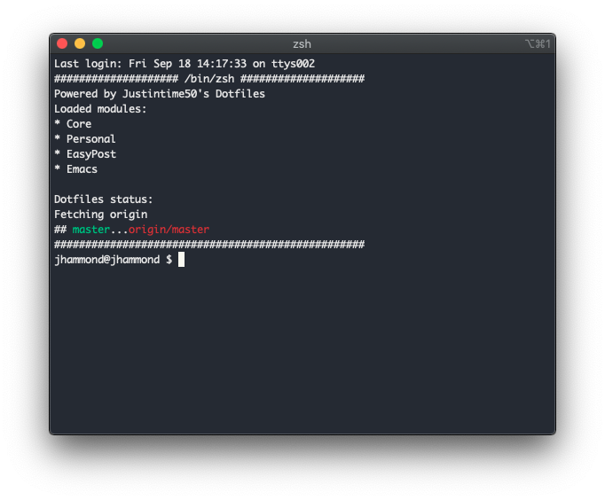

<div align="center">



My personal dotfiles. Automated push/pull changes and sync warning.

[](https://travis-ci.com/Justintime50/dotfiles)
[](https://opensource.org/licenses/mit-license.php)

</div>

Dotfiles are the configuration files that make your OS and tools do their magic. They are typically hidden, found in your home folder, and start with a `.` - thus they are called `Dotfiles`.

This project makes keeping dotfiles synced between machines a breeze. All dotfiles live in `~/dotfiles` and are symlinked to their respective location. Each time a terminal is started, Dotfiles will check to make sure that your local copy matches the remote copy and warn you if the copies diverge. You can then run a single command to push/pull the changes as needed to sync your dotfiles.

## Usage

### Install Dotfiles

```bash
curl -s https://raw.githubusercontent.com/justintime50/dotfiles/master/src/scripts/install.sh | bash --personal

# Options (one is required):
# -p, --personal    Install personal dotfiles
# -e, --easypost    Install EasyPost dotfiles

echo "source $HOME/dotfiles/src/personal/.zshrc" >> ~/.zshrc
```

### Push/Pull Dotfiles

Once installed, you can push/pull any changes with these easy commands. *Be aware that pushing/pulling will overwrite the current dotfiles!*

```bash
# Push dotfiles to GitHub
push-dotfiles

# Pull dotfiles from GitHub
pull-dotfiles
```
